# Algorithmic Trading

This project utilizes machine learning methods to predict and backtest different trading algorithms.

---

## Technologies

This project leverages Jupyter notebook and Pandas.

---

## Installation Guide

Before running the application, please install the following libraries and dependencies

```python

import pandas as pd
import numpy as np
from pathlib import Path
import hvplot.pandas
import matplotlib.pyplot as plt
from sklearn import svm
from sklearn.preprocessing import StandardScaler
from pandas.tseries.offsets import DateOffset
from sklearn.metrics import classification_report
from sklearn.ensemble import AdaBoostClassifier

```

Then, clone the repository onto your local computer.

---

## Report and Findings


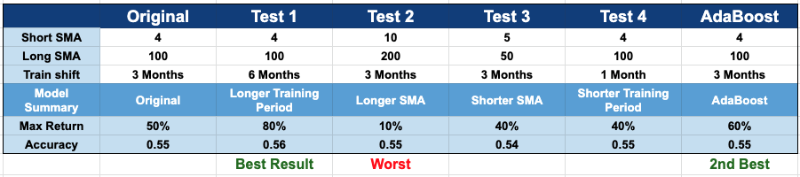


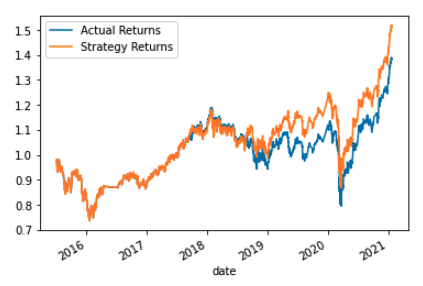

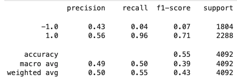


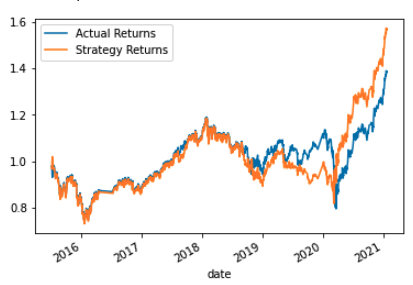

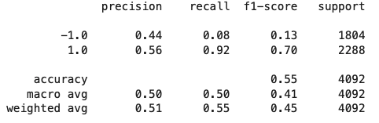


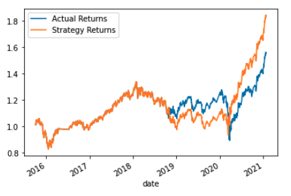

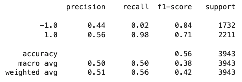

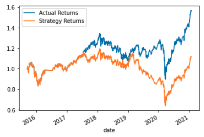

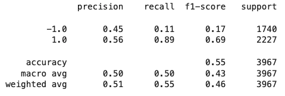


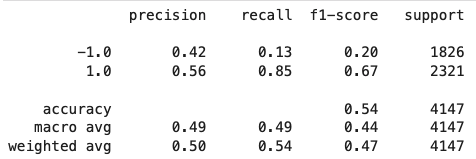


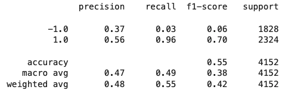


---

## Contributors

Initial code is provided by: UC Berkeley Fintech Bootcamp

Code is modified by: Kevin BaRoss [[LinkedIn](https://www.linkedin.com/in/kevin-baross/)]


---

## License
MIT
