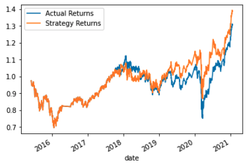

# Algorithmic Trading

This project utilizes machine learning methods to predict and backtest different trading algorithms.

---

## Technologies

This project leverages Jupyter notebook and Pandas.

---

## Installation Guide

Before running the application, please install the following libraries and dependencies

```python

import pandas as pd
import numpy as np
from pathlib import Path
import hvplot.pandas
import matplotlib.pyplot as plt
from sklearn import svm
from sklearn.preprocessing import StandardScaler
from pandas.tseries.offsets import DateOffset
from sklearn.metrics import classification_report
from sklearn.ensemble import AdaBoostClassifier

```

Then, clone the repository onto your local computer.

---

## Report and Findings

We can see that the original model with the 3-month of training period shift and the short SMA and long SMA of 4 and 100 respectively yields an accuracy score of 0.55 with a max return of 50% at the end of the period. The following table and plot illustrate this finding.


#### Modification 1

When we tried to tune the model to incorporate longer training period of 6 months shift, we got slightly better accuracy of 0.56, but a significantly better return of up to 80%.


#### Modification 2

In the second modification, we increased the period of short SMA and long SMA period to 10 and 200 respectively (from 4 and 100) with the same 3-month of training period shift. Even though this model also yields an accuracy of 0.55, the max potential return is even worse, only 10%, which is less than the standard market return. This can be seen from the fact that the blue line exceeds the orange line in the plot below.


#### Modification 3

In the third modification, we shortened the period of long SMA period from 100 to 50 with the same 3-month of training period shift. 
This model yields slightly lower accuracy score of 0.54, with the max potential return of 40%.




#### Modification 4

In the fourth modification, we kept the period of short SMA and long SMA at 4 and 100, respectively, which are the same as the original model, but we shortened the training period shift from 3 months to 1 month. This model yields an accuracy score of 0.55 with the max potential return of 40%.


#### Modification 5

In this modification, we changed the classification method to use the AdaBoost classifier. To see the effect of this classifier, we kept all other variables the same as in the first model. This classifier yields an accuracy score of 0.55, with a 60% potential return.


#### Conclusion

To summarize, we can see that the modification with the longest training period shift yield the best result with the potential return of up to 80% (test 1), while the model that yields the worst return is the one with the longest SMA of 200 trading days (test 2). The accuracy score is very similar across all modifications, so the max return metric would be more appropriate in deciding which model is the most appropriate to use in this case. The summary table of each modification is shown below.


---

## Contributors

Initial code is provided by: UC Berkeley Fintech Bootcamp

Code is modified by: Kevin BaRoss [[LinkedIn](https://www.linkedin.com/in/kevin-baross/)]


---

## License
MIT
